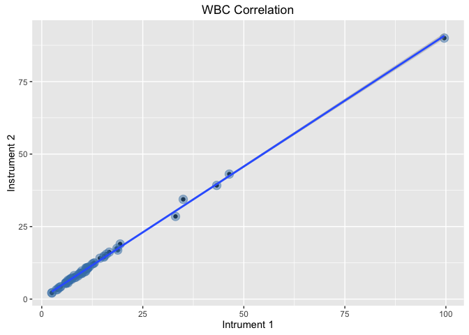

# co-R-relation
Felix Barangan, MS,RN,MLS(ASCP)  
April 24, 2016  
        
## Concept
This application is an attempt to perform and show statistical comparison of two instruments in order to comply from the increase regulations by State and other regulatory bodies on total quality and risk management
                                   
###Plots and Diagram
* Scatter Plot

        
Reading files
<!-- -->

              
        
