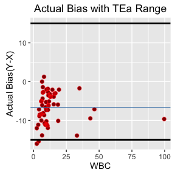

# co-R-relation
Felix Barangan, MS,RN,MLS(ASCP)  
April 24, 2016  

                                                                     

               
## Concept
This application is an attempt to perform and show statistical comparison of two instruments in order to comply from the increase regulations by State and other regulatory bodies on total quality and risk management
## Data loading and manipulations                                  
files added and processed for data minning and correlations     


```r
# loading file...
x <- read.csv("Instrument1.csv")
y <- read.csv("Instrument2.csv")
```
       

                

                                                                                                                                                       


                                       
###Plots and Diagram
* Scatter Plot

<!-- --><!-- --><!-- -->

